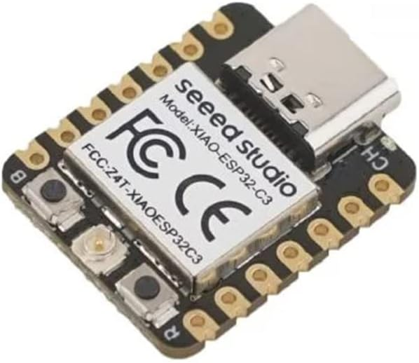
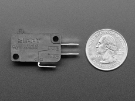
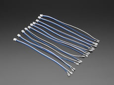
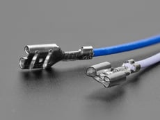
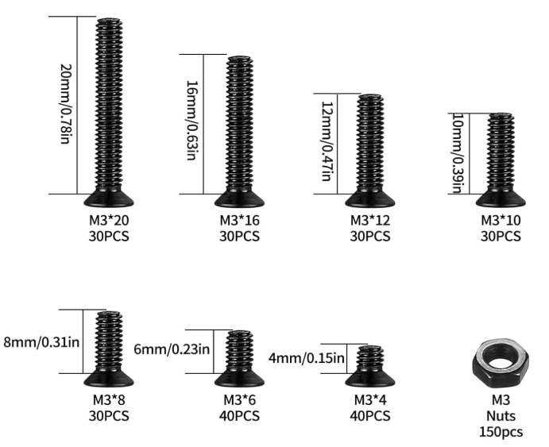
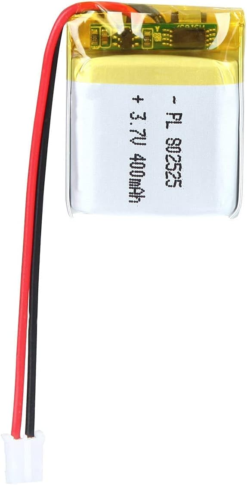
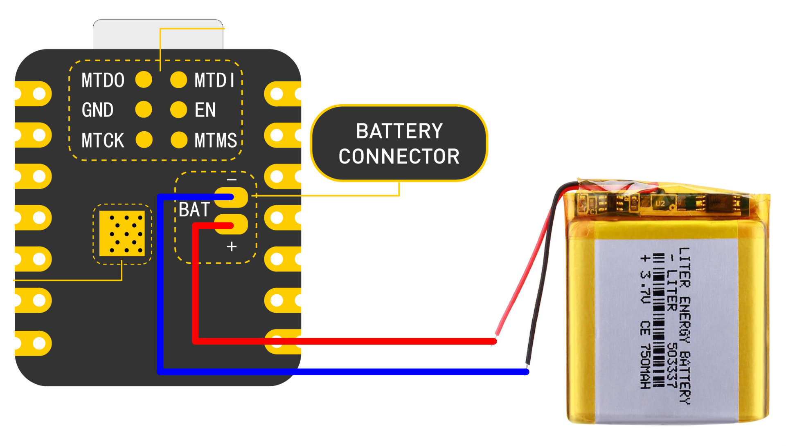
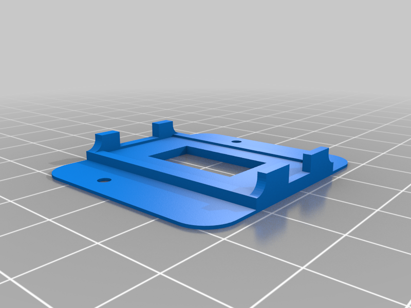
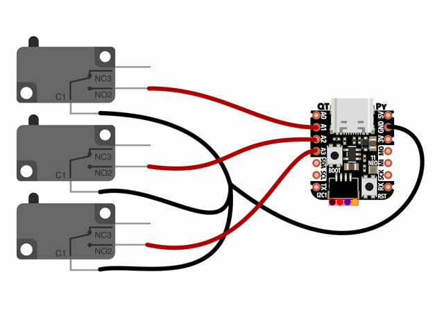

# Blue Pedal
Files, Process, and Code to have a bluetooth enabled pedal to count stitches or whatever may need counting with a foot.

# Overview
The general reason for this project is to create a foot operated mechanism that will allow someone to count to a set number while correcting as necessary and then resetting back to zero and repeating. This allows for accurate counting to a number and then resetting while allowing for corrections.

The original motivation for this design was to count crochet stitches for a row, and reset once the row was complete. An example web application has been included to serve that purpose.

# Materials
Xiao ESP32C3  [Amazon](https://a.co/d/3PdEz2W) 

A multifunctional processor with BLE (Bluetooth Low Energy) and Wifi built in to the chip. The BLE is used to transmit to a compatible web browser which has a page loaded to interpret the signals sent from the device.

[3D Printed Parts](https://www.thingiverse.com/thing:5237349)

Originally created by Lady Ada from Adafruit, 

Access to a 3d printer and appropriate printer materials is required. You can send this off to a service for printing as well. My prints took about 12 hours.

[Micro Switch x3](https://www.adafruit.com/product/817)

[Wires with connectors for the switches](https://www.adafruit.com/product/3835)

[M3 Screws and nuts](https://a.co/d/eXKQyFs)

[Optional Battery](https://a.co/d/fkS74rt)

Connecting the battery requires soldering the cut wires to the bottom of the ESP32C3 board. Putting a power switch on this circuit is recommended.

# Printing

Print the parts and prepare to assemble them. Instructions can be found on [AdaFruit website](https://learn.adafruit.com/three-button-foot-switch/assemble). The ESP32C3 from Amazon will fit rather snugly. There is an extra piece that is not needed in this design. The extra part is called kb2040_mount and looks like this:

# Schematics

# Setup & Code

You will need to configure your [Arduino IDE](https://www.arduino.cc/en/software/) with the Xiao ESP32C3 using the [Xiao ESP32C3 getting started tutorial](https://wiki.seeedstudio.com/XIAO_ESP32C3_Getting_Started/)

The [source code](src/main/arduino/blue-pedal/blue-pedal.ino) can be found in the repository. This needs to be loaded into the Arduino IDE, compiled, and uploaded to the Xiao board.

# Website

The [Web Page](src/main/webapp/index.html) that can control the Pedal Board can be found in the repository

A live website can be located here: [Pedal.Questionable.Codes](https://zod.vg/yBWa)

The Bluetooth API does not work in all browsers, Apple Safari & Firefox are browsers yet without this functionality.

Here is the [Bluetooth API Compatibility Chart](https://developer.mozilla.org/en-US/docs/Web/API/Web_Bluetooth_API#browser_compatibility)

# Video of Operation

Here is a quick video with a battery operated device

# Links
* https://www.thingiverse.com/thing:5237349
* https://learn.adafruit.com/three-button-foot-switch/

* https://www.seeedstudio.com/Seeed-XIAO-ESP32C3-p-5431.html
* https://www.adafruit.com/product/3406

* https://youtu.be/SsnqrpUQLbk?si=SMgRHoyNdtn1Hoo1

* https://wiki.seeedstudio.com/XIAO_ESP32C3_Getting_Started/
* https://randomnerdtutorials.com/esp32-webserial-library/
* https://forum.arduino.cc/t/can-i-send-serial-monitor-data-over-bluetooth-with-esp32/886250
* https://randomnerdtutorials.com/esp32-web-bluetooth/